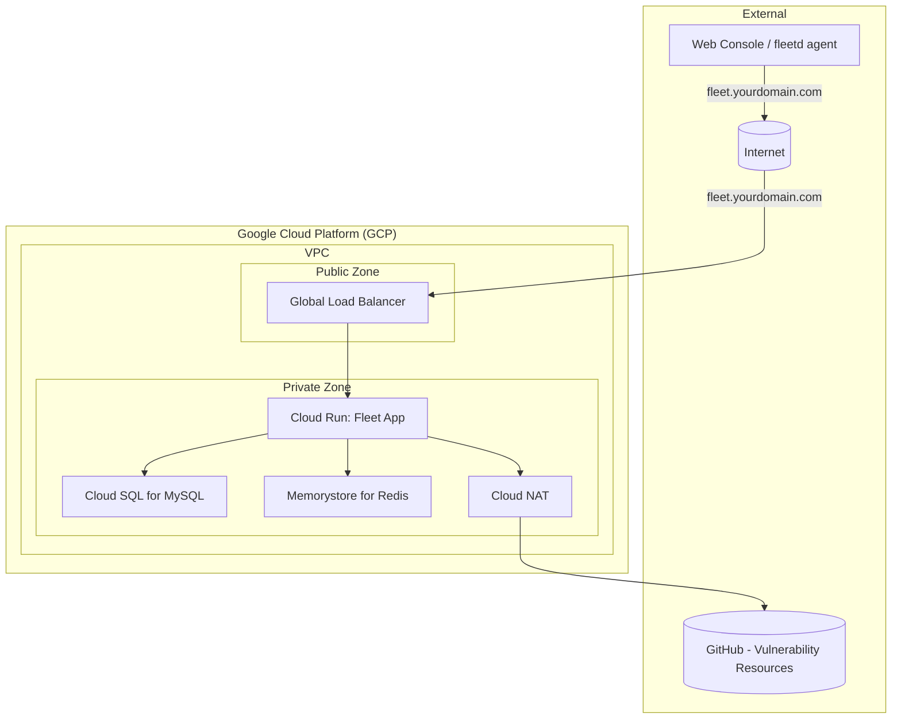

# Terraform Google Cloud Fleet Deployment

This Terraform project automates the deployment of Fleet Device Management (Fleet) on the Google Cloud Platform (GCP). It provisions a new GCP project (or uses an existing one if configured) and deploys all necessary infrastructure components, including:

*   A new Google Cloud Project (via `terraform-google-modules/project-factory`)
*   VPC Network and Subnets
*   Cloud NAT for outbound internet access
*   Cloud SQL for MySQL (database for Fleet)
*   Memorystore for Redis (caching for Fleet)
*   Google Cloud Storage (GCS) bucket (for Fleet software installers, S3-compatible access configured)
*   Google Secret Manager (for storing sensitive data like database passwords and Fleet server private key)
*   Cloud Run v2 Service (for the main Fleet application)
*   Cloud Run v2 Job (for database migrations)
*   External HTTP(S) Load Balancer with managed SSL certificate
*   Cloud DNS for managing the Fleet endpoint
*   Appropriate IAM service accounts and permissions

## Prerequisites

1.  **Terraform:** Version `~> 1.11` (as specified in `main.tf`). Install from [terraform.io](https://www.terraform.io/downloads.html).
2.  **Google Cloud SDK (`gcloud`):** Installed and configured. Install from [cloud.google.com/sdk](https://cloud.google.com/sdk/docs/install).
3.  **GCP Account & Permissions:**
    *   A Google Cloud Organization ID.
    *   A Billing Account ID.
    *   Credentials configured for Terraform to interact with GCP. This typically means running `gcloud auth application-default login` with a user account that has:
        *   `Organization Administrator` or `Folder Creator` & `Project Creator` roles at the Organization/Folder level (for the `project-factory` module).
        *   `Billing Account User` role on the Billing Account.
        *   Once the project is created, subsequent applies for resources within the project will generally require `Owner` or `Editor` on the provisioned project.
    *   Alternatively, use a Service Account with appropriate permissions.
4.  **Registered Domain Name:** You will need a domain name that you can manage DNS records for. This project will create a Cloud DNS Managed Zone for this domain (or a subdomain).
5.  **(Optional) Fleet License Key:** If you have a premium Fleet license, you can provide it.

## Configuration

1.  **Clone the repository (if applicable) or ensure you have all the files.**
2.  **Create a `terraform.tfvars` file:**
    Copy `terraform.tfvars.example` (you'll need to create this, see example below) to `terraform.tfvars` and populate it with your specific values.

    **Example `terraform.tfvars.example`:**
    ```hcl
    # Required: GCP Organization and Billing
    org_id               = "YOUR_ORGANIZATION_ID" # e.g., "123456789012"
    billing_account_id   = "YOUR_BILLING_ACCOUNT_ID" # e.g., "012345-6789AB-CDEF01"

    # Required: DNS Configuration
    # The public DNS zone name (e.g., "example.com." - note the trailing dot)
    # This project will create/manage this zone in Cloud DNS.
    dns_zone_name        = "your-domain.com."
    # The fully qualified domain name for your Fleet instance (e.g., "fleet.your-domain.com.")
    dns_record_name      = "fleet.your-domain.com."

    # Optional: Project Configuration
    project_name         = "my-fleet-project" # Name for the new GCP project
    random_project_id    = true               # Set to false if you want to use project_name as project_id (must be globally unique)

    # Optional: Labels
    labels = {
      application = "fleet"
      environment = "production"
      owner       = "devops-team"
    }

    # --- byo-project module specific variables (passed through from root) ---
    # You can override defaults from byo-project/variables.tf here if needed,
    # or set values for variables that don't have defaults.

    # Example: Fleet Configuration including migration execution
    fleet_config = {
      # image_tag                = "fleetdm/fleet:v4.x.y" # Specify your desired Fleet version
      # license_key              = "YOUR_FLEET_LICENSE_KEY"
      # installers_bucket_name   = "my-unique-fleet-installers" # Must be globally unique
      # fleet_cpu                = "1000m"
      # fleet_memory             = "4096Mi"
      # debug_logging            = false
      # min_instance_count       = 1
      # max_instance_count       = 3
      # exec_migration           = true # Set to true to run migrations on `terraform apply`
                                       # (e.g., when changing image_tag)
    }

    ```


**Key Variables to Set:**
  
* `org_id`: Your GCP Organization ID.
*   `billing_account_id`: Your GCP Billing Account ID.
*   `dns_zone_name`: The DNS zone that will be created/managed in Cloud DNS (e.g., `mydomain.com.`). **Must end with a dot.**
*   `dns_record_name`: The specific DNS record for Fleet (e.g., `fleet.mydomain.com.`). **Must end with a dot.**
*   `project_name`: A descriptive name for the project to be created.
*   `fleet_config.image_tag`: The Docker image tag for the Fleet version you want to deploy (e.g., `fleetdm/fleet:v4.67.3`).
*   `fleet_config.exec_migration`: Set to `true` when you are upgrading the `fleet_config.image_tag` to automatically run database migrations. Set to `false` if you want to manage migrations manually or if it's not an image upgrade.
*   `fleet_config.license_key` (Optional, inside the `fleet_config` object): Your Fleet license key if you have one.

Review `variables.tf` and `byo-project/variables.tf` for all available options and their defaults.


## Deployment Steps

1.  **Authenticate with GCP:**
    Ensure your `gcloud` CLI is authenticated with the account having the necessary permissions.
    ```bash
    gcloud auth application-default login
    ```

2.  **Initialize Terraform:**
    Navigate to the root directory of the project (where `main.tf` is located) and run:
    ```bash
    terraform init
    ```

3.  **Plan the Deployment:**
    Review the changes Terraform will make:
    ```bash
    terraform plan -out=tfplan
    ```

4.  **Apply the Configuration:**
    Provision the resources:
    ```bash
    terraform apply tfplan
    ```
    This process can take a significant amount of time (10–20 minutes or more), especially for the initial project creation, API enablement, and Cloud SQL instance provisioning.

5.  **Update DNS (if not using Cloud DNS for the parent zone):**
    If `dns_zone_name` (e.g., `fleet.your-domain.com.`) is a new zone created by this Terraform, and your parent domain (e.g., `your-domain.com.`) is managed elsewhere (e.g., GoDaddy, Cloudflare), you need to delegate this new zone.
    *   Get the Name Servers (NS) records for the newly created `google_dns_managed_zone` (`${var.prefix}-zone`):
        ```bash
        # First, get the project ID and zone name if you don't know them
        PROJECT_ID=$(terraform output -raw project_id 2>/dev/null || gcloud projects list --filter="name~^my-fleet-project" --format="value(projectId)" | head -n 1)
        DNS_ZONE_INTERNAL_NAME="fleet-zone" # Or as configured by 'prefix' variable

        gcloud dns managed-zones describe ${DNS_ZONE_INTERNAL_NAME} \
            --project=${PROJECT_ID} \
            --format="value(nameServers)"
        ```
    *   Add these NS records to your parent domain's DNS settings at your domain registrar or DNS provider.

    If `dns_zone_name` (e.g., `your-domain.com.`) was an *existing* zone you own and manage via Cloud DNS in this project, Terraform would add records to it directly. The current setup *creates* the zone, so delegation is key if the parent is external.

## Accessing Fleet

Once the deployment is complete, database migrations have run successfully, and DNS has propagated (which can take a few minutes):

*   Open your web browser and navigate to the `dns_record_name` you configured (e.g., `https://fleet.your-domain.com`).
*   You should be greeted by the Fleet setup page or login screen.

## Key Resources Created (within the `byo-project` module)

*   **VPC Network (`fleet-network`):** Custom network for Fleet resources.
*   **Subnet (`fleet-subnet`):** Subnetwork within the VPC.
*   **Cloud Router & NAT (`fleet-cloud-router`, `fleet-vpc-nat`):** For outbound internet access from Cloud Run and other private resources.
*   **Cloud SQL for MySQL (`fleet-mysql-xxxx`):** Managed MySQL database.
*   **Memorystore for Redis (`fleet-cache`):** Managed Redis instance.
*   **GCS Bucket (`fleet-installers-xxxx`):** For S3-compatible storage.
*   **Secret Manager Secrets:**
    *   `fleet-db-password-xxxx`: Stores the generated MySQL user password.
    *   `fleet-private-key-xxxx`: Stores a generated private key for Fleet server.
*   **Service Account (`fleet-run-sa`):** Used by Cloud Run services/jobs with necessary permissions.
*   **Cloud Run Service (`fleet-service`):** Hosts the main Fleet application.
*   **Cloud Run Job (`fleet-migration-job`):** For database migrations.
*   **Network Endpoint Group (`fleet-neg`):** Connects the Load Balancer to the Cloud Run service.
*   **Cloud DNS Managed Zone (`fleet-zone`):** Manages DNS records for `dns_zone_name`.
*   **External HTTP(S) Load Balancer (`fleet-lb`):** Provides public access to Fleet via HTTPS.
*   **DNS A Record:** Points `dns_record_name` to the Load Balancer's IP.

(Note: `xxxx` indicates a random suffix added by some modules/resources for uniqueness.)

## Cleaning Up

To destroy all resources created by this Terraform project:
1.  Navigate to the root directory of the project.
2.  Run the destroy command:
    ```bash
    terraform destroy
    ```
3.  Confirm by typing `yes` when prompted.

## Important Considerations

*   **Permissions:** The user or service account running Terraform needs extensive permissions, especially for project creation. For ongoing management within the project, a role like `Project Editor` or more granular roles might suffice.
*   **Fleet Configuration:** This Terraform setup provisions the infrastructure. Further Fleet application configuration (e.g., SSO, SMTP, agent options) will need to be done through the Fleet UI or API after deployment.
*   **Security:**
    *   Review IAM permissions granted.
    *   The Load Balancer is configured for HTTPS and redirects HTTP.
    *   Cloud SQL and Memorystore are not publicly accessible and are connected via Private Service Access.
*   **Scalability:** Cloud Run scaling parameters (`min_instance_count`, `max_instance_count`) and database/cache tier can be adjusted in `variables.tf` (via `fleet_config`, `database_config`, `cache_config`) to suit your load.


### Networking Diagram
